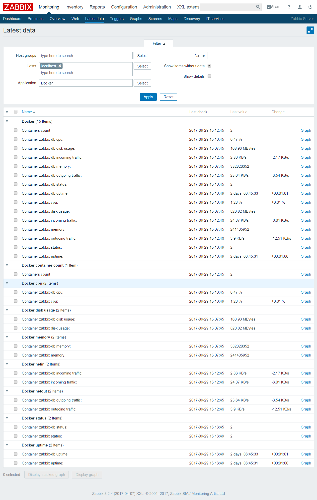

# Docker containers discovery and monitoring

Requirements: 
- Python 2.7.13
- netcat (ubuntu: `sudo apt-get install netcat`)
- jq (ubuntu: `sudo apt-get install jq`)

In addition to the provided [template](../templates) the script is compatible with www.monitoringartist.com docker monitoring templates that's included by default in [zabbix-xxl](https://github.com/monitoringartist/dockbix-xxl).

The zabbix user must have enough privileges to monitor docker

* Either add zabbix user to docker group `sudo usermod -aG docker zabbix`
* Or add a file under `/etc/sudoers.d` containing line `zabbix ALL=(ALL:ALL) NOPASSWD: /bin/netcat`

## Usage

Item Syntax | Description | Units |
----------- | ----------- | ----- |
docker.containers.discovery | Discover all running Docker containers | Provides the following template variables: {#CONTAINERID}, {#CONTAINERNAME}, {#HCONTAINERID} |
docker.containers.count | Number of all running Docker containers | (number) |
docker.containers.discovery.all | Discover all Docker containers | Provides the following template variables: {#CONTAINERID}, {#CONTAINERNAME}, {#HCONTAINERID} |
docker.containers.count.all | Number of all Docker containers | (number) |
docker.containers[{#CONTAINERID}, netin] | Incoming network traffic (eth0) of the container | bytes per second (B/s) |
docker.containers[{#CONTAINERID}, netout] | Outgoing network traffic (eth0) of the container | bytes per second (B/s) |
docker.containers[{#CONTAINERID}, cpu] | Container CPU usage | % |
docker.containers[{#CONTAINERID}, disk] | Container disk usage | bytes |
docker.containers[{#CONTAINERID}, memory] | Container memory usage | bytes |
docker.containers[{#CONTAINERID}, uptime] | Container uptime | uptime (seconds) |
docker.containers[{#CONTAINERID}, up] | Is container up and running? | 1 (yes), 0 (no) |
docker.containers[{#CONTAINERID}, status] | Container status | 0 (exited with error or no such container), 1 (running), 2 (not running) |

## Example

